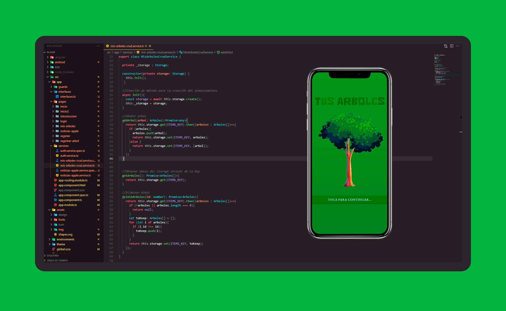

# iOS and Android Tus Arboles 
Aplicación para almacenar tus árboles favoritos.




## 🌲 Iniciar APP

Clonamos el proyecto
```bash
	git clone https://github.com/thLaurence/ia-tus-arboles.git
```
Copiamos la carpeta src a un proyecto iniciado
de Ionic-Angular

A continuación instalamos los siguientes requerimientos
```bash
	npm install @ionic/storage-angular
	npm install firebase @angular/fire --save
```
Iniciamos la aplicación de manera local
```bash
	ionic serve --lab
```
o en forma de navegador
```bash
	ionic serve
```
## ©️ Copyright

**`LICENSE`**: MIT

Check the file [here](./LICENSE)